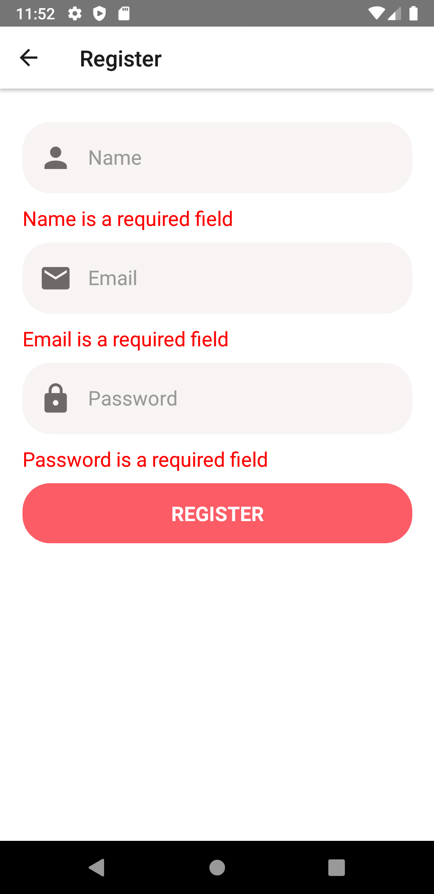

# <H1>Deals-App</h1>
<h3>E-Commerce app "Sell what you don't need"</h3>

<H1>Deals App</h1>
<h4>Deals App work with Node.js BackEnd.</h4>
<h4>Run Deal App and Backend App on seprate tabs(Windows).</h4>
<h4>For node js edit development.json file with Machine IP Address as well as on Config File on Deal App. Must Have same Machine Id.</h4>
eg. http://192.168.1.11:9000/assets/

<video width="300" height="auto" controls>
  <source src="DealApp/Assets/Screenshot/DealApp.mp4" type="video/mp4">
</video>

